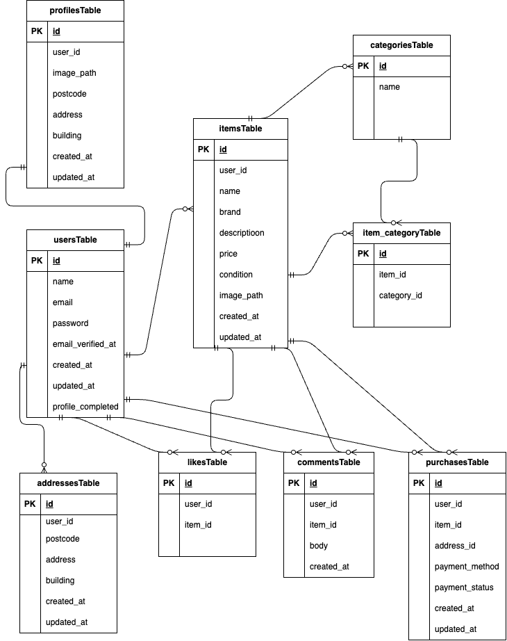

# freemarket(フリマアプリ)

## 環境構築
**Dockerビルド**
1. `git clone git@github.com:maaaakka/coachtech-freemarket.git`
2. DockerDesktopアプリを立ち上げる
3. `docker-compose up -d --build`

> *MacのM1・M2チップのPCの場合、`no matching manifest for linux/arm64/v8 in the manifest list entries`のメッセージが表示されビルドができないことがあります。
エラーが発生する場合は、docker-compose.ymlファイルの「mysql」内に「platform」の項目を追加で記載してください*
``` bash
mysql:
    platform: linux/amd64(この文追加)
    image: mysql:8.0.26
    environment:
```

**Laravel環境構築**
1. `docker-compose exec php bash`
2. `composer install`
3. 「.env.example」ファイルを 「.env」ファイルに命名を変更。または、新しく.envファイルを作成
4. .envに以下の環境変数を追加
``` text
DB_CONNECTION=mysql
DB_HOST=mysql
DB_PORT=3306
DB_DATABASE=laravel_db
DB_USERNAME=laravel_user
DB_PASSWORD=laravel_pass
```
5. Fortify導入
``` bash
composer require laravel/fortify

php artisan vendor:publish --provider="Laravel\Fortify\FortifyServiceProvider"
```
6. アプリケーションキーの作成
``` bash
php artisan key:generate
```

7. マイグレーションの実行
``` bash
php artisan migrate
```

8. シーディングの実行
``` bash
php artisan db:seed
```

9. Stripeインストール
```bash
composer require stripe/stripe-php
```
StripeダッシュボードからAPIキーを取得し、.envに追加


10. Stripe CLIインストール(Webhook用)
```bash
brew install stripe/stripe-cli/stripe
```
Windowsの場合
https://stripe.com/docs/stripe-cli からインストーラーをダウンロード

stripe loginでブラウザが開くためStripeアカウントでログイン

Webhook転送(Stripeと別タブ)
```bash
stripe listen --forward-to http://localhost/stripe/webhook
```
Ready! Your webhook signing secret is whsec_xxxxx
このwhsec_以下のシークレットを.envに追加


## Stripe設定
.env に以下を追加
``` text
STRIPE_KEY=your_public_key
STRIPE_SECRET=your_secret_key
STRIPE_WEBHOOK_SECRET=your_webhook_secret
```


**メール認証機能**
Laravelのメール認証機能を使用して実装

認証フロー
	1.	会員登録
	2.	認証メール送信
	3.	メール内リンククリック
	4.	プロフィール設定画面へ遷移


## 主な機能
	•	会員登録 / ログイン
	•	メール認証
	•	プロフィール設定
	•	商品一覧表示
	•	商品出品
	•	商品詳細表示
	•	いいね機能
	•	コメント機能
	•	商品購入機能


## 使用技術(実行環境)
- PHP8.3.0
- Laravel8.83.27
- MySQL8.0.26
- Stripe API

## ER図


## URL
- 開発環境：http://localhost/
- phpMyAdmin:：http://localhost:8080/
